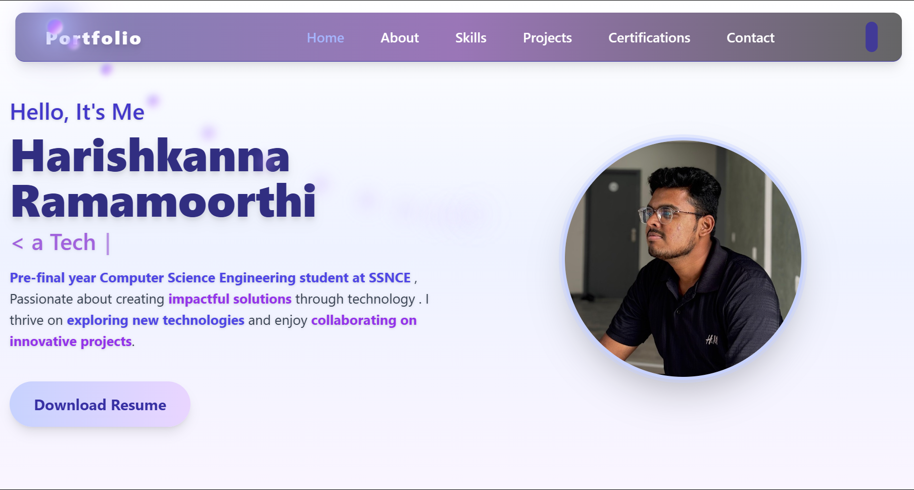

# 🚀 Harishkanna R - Personal Portfolio

A modern, responsive portfolio website built with React, showcasing my skills, projects, and professional experience. Features a beautiful dark/light theme toggle, animated components, and integrated contact form functionality.



## ✨ Features

- **🎨 Modern UI/UX**: Clean, professional design with smooth animations
- **🌙 Dark/Light Theme**: Toggle between dark and light modes
- **📱 Fully Responsive**: Optimized for all devices and screen sizes
- **📧 Contact Form**: Integrated EmailJS for seamless communication
- **⚡ Fast Performance**: Built with Vite for optimal loading speeds
- **🎯 Smooth Scrolling**: Enhanced navigation experience
- **📊 Project Showcase**: Beautiful timeline of my projects
- **🎓 Skills & Certifications**: Professional skills and achievements display

## 🛠️ Technologies & Libraries Used

### **Frontend Framework**
- **React 19** - Modern JavaScript library for building user interfaces
- **Vite** - Fast build tool and development server

### **Styling & UI**
- **Tailwind CSS** - Utility-first CSS framework for rapid UI development
- **Boxicons** - Beautiful open source icons
- **Custom CSS Animations** - Smooth transitions and hover effects

### **Development Tools**
- **ESLint** - Code linting and quality assurance
- **PostCSS** - CSS processing and optimization
- **Autoprefixer** - CSS vendor prefixing

### **Build & Deployment**
- **Vite Build** - Optimized production builds
- **GitHub Pages** - Free hosting platform
- **Git Version Control** - Code management and collaboration

## 📁 Project Structure

```
my-project/
├── src/
│   ├── components/
│   │   ├── Home.jsx              # Hero section with introduction
│   │   ├── About.jsx             # Personal background and experience
│   │   ├── Projects.jsx          # Project showcase with timeline
│   │   ├── Skills.jsx            # Technical skills display
│   │   ├── Contact.jsx           # Contact form with EmailJS
│   │   ├── Certifications.jsx    # Professional certifications
│   │   ├── Coding.jsx            # Coding profiles (LeetCode, GFG)
│   │   ├── Navbar.jsx            # Navigation component
│   │   └── ThemeToggle.jsx       # Dark/light theme switcher
│   ├── assets/
│   │   ├── project_pic/          # Project screenshots
│   │   │   ├── portflio.png      # Portfolio screenshot
│   │   │   ├── fire.png          # Fire fighting robot
│   │   │   ├── iot.jpg           # IoT weather station
│   │   │   ├── inverty.jpg       # Inventory management
│   │   │   └── ml.jpg            # ML workshop project
│   │   ├── certification/        # Professional certifications
│   │   │   ├── digital.jpg       # Digital marketing
│   │   │   ├── DSA C&C++.jpg     # DSA certification
│   │   │   ├── github.jpg        # GitHub certification
│   │   │   ├── LFS.jpg           # Linux certification
│   │   │   └── ML Workshop IISc.jpg # ML workshop
│   │   ├── Harishkanna.jpg       # Profile picture
│   │   ├── Harishkanna_2.jpg     # Secondary profile picture
│   │   ├── Harishkanna__Resume.pdf # Resume PDF
│   │   ├── gfg.jpg               # GeeksforGeeks profile
│   │   └── leetcode.jpg          # LeetCode profile
│   ├── App.jsx                   # Main application component
│   ├── App.css                   # Global styles
│   ├── index.css                 # Base styles and Tailwind imports
│   └── main.jsx                  # Application entry point
├── public/
│   └── vite.svg                  # Vite logo
├── index.html                    # HTML template
├── package.json                  # Dependencies and scripts
├── tailwind.config.js            # Tailwind configuration
├── vite.config.js                # Vite configuration
├── postcss.config.js             # PostCSS configuration
└── eslint.config.js              # ESLint configuration
```

## 🚀 Getting Started

### Prerequisites
- **Node.js** (v16 or higher)
- **npm** or **yarn** package manager
- **Git** for version control

### Installation

1. **Clone the repository**
   ```bash
   git clone https://github.com/HarishkannaR11/Harishkanna_Portfolio.git
   cd Harishkanna_Portfolio
   ```

2. **Install dependencies**
   ```bash
   npm install
   ```

3. **Start the development server**
   ```bash
   npm run dev
   ```

4. **Open your browser**
   Navigate to `http://localhost:5173`


### Setup Your Own EmailJS:
1. Create account at [EmailJS](https://www.emailjs.com/)
2. Set up email service (Gmail, Outlook, etc.)
3. Create email template with variables: `{{from_name}}`, `{{from_email}}`, `{{message}}`
4. Update configuration in `src/Contact.jsx`

## 🎨 Customization Guide

### **Theme Colors**
```javascript
// tailwind.config.js
module.exports = {
  theme: {
    extend: {
      colors: {
        indigo: {
          400: '#818cf8',
          500: '#6366f1',
          600: '#4f46e5',
          950: '#1e1b4b',
        },
        purple: {
          400: '#c084fc',
          500: '#a855f7',
          600: '#9333ea',
          950: '#2e1065',
        }
      }
    }
  }
}
```

### **Content Updates**
- **Personal Info**: Update `src/About.jsx`
- **Projects**: Modify `src/Projects.jsx`
- **Skills**: Edit `src/Skills.jsx`
- **Contact**: Update `src/Contact.jsx`
- **Certifications**: Edit `src/Certifications.jsx`

### **Adding New Sections**
1. Create new component in `src/`
2. Import in `App.jsx`
3. Add to navigation in `Navbar.jsx`

## 📱 Component Details

### **Home Component**
- Hero section with animated text
- Call-to-action buttons
- Professional photo display
- Smooth scroll navigation

### **About Component**
- Personal background and experience
- Education and achievements
- Professional summary with animations

### **Projects Component**
- Interactive project timeline
- GitHub integration with hover effects
- Project descriptions and technologies
- Responsive grid layout

### **Skills Component**
- Technical skills showcase
- Programming languages with progress bars
- Tools and technologies display
- Animated skill cards

### **Contact Component**
- Integrated EmailJS contact form
- Social media links (LinkedIn, GitHub, Twitter)
- Professional networking
- Form validation and error handling

### **Theme Toggle**
- Dark/light mode switching
- Persistent theme preference
- Smooth transition animations

## 🚀 Deployment Options

### **GitHub Pages**
```bash
# Build the project
npm run build

# Deploy to GitHub Pages
# Enable GitHub Pages in repository settings
# Source: Deploy from a branch (main)
# Folder: / (root)
```

### **Vercel**
1. Import GitHub repository
2. Framework preset: Vite
3. Build command: `npm run build`
4. Output directory: `dist`

## 📊 Performance Metrics

- **Lighthouse Score**: 95+ (Performance, Accessibility, Best Practices, SEO)
- **Loading Speed**: < 2 seconds
- **Mobile Responsive**: 100% compatible
- **SEO Optimized**: Meta tags and structured data
- **Bundle Size**: Optimized with Vite

## 🛠️ Development Scripts

```json
{
  "scripts": {
    "dev": "vite",                    // Development server
    "build": "vite build",            // Production build
    "preview": "vite preview",        // Preview production build
    "lint": "eslint ."                // Code linting
  }
}
```

## 📦 Dependencies

### **Core Dependencies**
```json
{
  "react": "^19.1.0",
  "react-dom": "^19.1.0",
  "@emailjs/browser": "^4.1.0"
}
```

### **Development Dependencies**
```json
{
  "@vitejs/plugin-react": "^4.6.0",
  "autoprefixer": "^10.4.21",
  "eslint": "^9.30.1",
  "postcss": "^8.5.6",
  "tailwindcss": "^3.4.17",
  "vite": "^7.0.4"
}
```

## 🤝 Contributing

1. Fork the repository
2. Create your feature branch (`git checkout -b feature/AmazingFeature`)
3. Commit your changes (`git commit -m 'Add some AmazingFeature'`)
4. Push to the branch (`git push origin feature/AmazingFeature`)
5. Open a Pull Request

## 📄 License

This project is licensed under the MIT License - see the [LICENSE](LICENSE) file for details.

## 👨‍💻 Author

**Harishkanna R**
- **GitHub**: [@HarishkannaR11](https://github.com/HarishkannaR11)
- **LinkedIn**: [Harishkanna Ramamoorthi](https://www.linkedin.com/in/harishkannar11)
- **Email**: krisharish11@gmail.com
- **GeeksforGeeks**: [krishar4wsb](https://www.geeksforgeeks.org/user/krishar4wsb/)

## 🙏 Acknowledgments

- **[React](https://reactjs.org/)** - Frontend framework
- **[Tailwind CSS](https://tailwindcss.com/)** - Styling framework
- **[EmailJS](https://www.emailjs.com/)** - Email service
- **[Boxicons](https://boxicons.com/)** - Icon library
- **[Vite](https://vitejs.dev/)** - Build tool
- **[GitHub Pages](https://pages.github.com/)** - Hosting platform

## 📈 Project Statistics

- **Total Files**: 40+
- **Lines of Code**: 5,000+
- **Components**: 8 React components
- **Assets**: 15+ images and files
- **Performance**: 95+ Lighthouse score

---

⭐ **Star this repository if you found it helpful!**

---

*Built with ❤️ by Harishkanna R using React, Tailwind CSS, and EmailJS*
